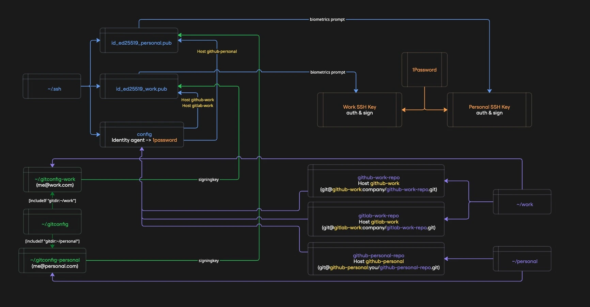

import SiteTooltip from '@site/src/components/site-lab/SiteTooltip/SiteTooltip';

A unified procedure for managing SSH keys across multiple GitHub and GitLab accounts - (almost) entirely from the terminal, with no private keys on disk. Works for both first-time setup and key rotation.

{/* truncate */}

By the end of this guide, you'll have a setup where: 
- Local repos are split in `~/work` and `~/personal` directories
- SSH keys are used for both authentication and signing (no GPG overhead)
  - one for work accounts (GitHub + GitLab)
  - one for personal account (GitHub)
- private keys never touch your filesystem
- SSH and Git operations are gated behind biometric authentication by default
- rotating keys across all your accounts is a single terminal session away



:::note
This guide is written for **macOS**. The core concepts (1Password SSH agent, `op read`, lazy-loading context secrets, Git `includeIf`) apply cross-platform, but paths and biometric settings will differ on Linux and Windows.
:::

## The problem

Managing SSH keys the traditional way has real costs - and real risks.

**Security:** 

Private keys sitting in `~/.ssh` are a prime target. Recent supply chain attacks have focused specifically on exfiltrating environment variables and credentials from developer machines and CI runners. A private key on disk - especially one without a passphrase - is one compromised dependency away from being leaked.

**Operational pain:**
- **Key rotation** is manual and tedious - generate new keys, update every remote, fix configs, hope you didn't miss one
- **Forgotten passphrases** lock you out at the worst times, or worse, lead to passphrase-less keys
- **Key sprawl** - multiple keys in `~/.ssh` with no clear mapping to accounts or purposes
- **GPG complexity** - commit signing with GPG means managing a whole separate keyring, expiration dates, and subkeys
- **Multi-account confusion** - pushing with the wrong identity to the wrong repo because SSH and Git configs are out of sync

**How 1Password SSH Agent helps:**
- **No private keys on disk** - private keys live exclusively in 1Password's encrypted vault; only `.pub` files are stored in `~/.ssh`
- **Biometric-gated access** - SSH operations require Touch ID / fingerprint by default; even with approval caching, private key material stays non-extractable, so a compromised process can't steal your keys for offline or remote use
- **Single source of truth** - one place to manage keys, rotate them, and revoke access
- **Built-in SSH signing** - commit signing without GPG, using the same keys you authenticate with

## What this guide covers

This guide consolidates everything into a single, repeatable workflow:

- **Generate** ed25519 keys via 1Password (no `ssh-keygen`)
- **Store** private keys exclusively in 1Password SSH Agent (nothing on disk)
- **Register** keys on GitHub and GitLab using stateless CLI aliases
- **Configure** SSH commit signing - no GPG needed
- **Rotate** keys by re-running the same procedure

The commands include guards to handle missing items gracefully, so the same steps work for both first-time setup and key rotation.

## Prerequisites

### CLI tools

```bash
brew install --cask 1password  # if not already installed
brew install 1password-cli     # `op` CLI
brew install gh                # GitHub CLI
brew install glab              # GitLab CLI
brew install python3           # used for JSON parsing in glab helpers
```

### Enable 1Password SSH Agent

This step requires the GUI. Make sure these three options are enabled:

**1Password → Settings → Developer → ✅ "Use the SSH Agent"**

**1Password → Settings → Developer → ✅ "Integrate with 1Password CLI"**

**1Password → Settings → Developer → ✅ "Integrate with other apps"**

You only need to do this once, ever.

### `work` and `personal` repositories setup

I manage three Git accounts: a **personal GitHub**, a **work GitHub**, and a **work GitLab**. This guide follows that setup. Most people only need two (personal GitHub + work GitHub) - if that's you, just skip the GitLab parts and the guide still applies.

This guide assumes you organize your repositories into two top-level directories:

```
~/work/         # all work-related repos
~/personal/     # all personal repos
```

This isn't arbitrary - Git's [`includeIf`](https://git-scm.com/docs/git-config#_conditional_includes) directive uses directory paths to conditionally load config files. By cloning work repos under `~/work/` and personal repos under `~/personal/`, Git automatically applies the right identity (email, signing key, commit signing) based on where you are - no manual switching, no mistakes.

**What this gives you:**
- **Automatic identity switching** - `git commit` in `~/work/some-repo` uses your work email and signing key; in `~/personal/some-repo` it uses your personal ones
- **Per-context commit signing** - work repos can enforce signed commits while personal repos use a different key
- **Zero config per repo** - no need to run `git config user.email` in every new clone

If you use a different directory structure, adjust the `includeIf` paths in `~/.gitconfig` and the variables in `~/.zshrc` accordingly.

### Shell config (`~/.zshrc`)

Add the following to your `~/.zshrc`. The configuration variables at the top are referenced by all procedure steps - customize them once here, and every new terminal session picks them up automatically.

Open the file in edit mode:
```bash
code ~/.zshrc
```

Add the configuration:
```bash title="~/.zshrc"
# --- Configuration (customize these for your setup) ---
# 1Password settings
export OP_BIOMETRIC_UNLOCK_ENABLED=true
export OP_ACCOUNT=https://my.1password.com/
OP_VAULT_NAME="Personal"
OP_SOCK_PATH=~/Library/Group\ Containers/2BUA8C4S2C.com.1password/t/agent.sock

# 1Password item names
GH_WORK_PAT_NAME="GitHub PAT - Work"
GH_PERSONAL_PAT_NAME="GitHub PAT - Personal"
GLAB_WORK_PAT_NAME="GitLab PAT - Work"
SSH_WORK_NAME="SSH - Work"
SSH_PERSONAL_NAME="SSH - Personal"

# Public key file paths
SSH_WORK_PUB_PATH=~/.ssh/id_ed25519_work.pub
SSH_PERSONAL_PUB_PATH=~/.ssh/id_ed25519_personal.pub

# Git emails (for signing + allowed_signers)
WORK_EMAIL="you@work.com"
PERSONAL_EMAIL="you@gmail.com"

# Git config file paths
GITCONFIG_WORK_PATH=~/.gitconfig-work
GITCONFIG_PERSONAL_PATH=~/.gitconfig-personal

# --- Context-aware secret loader ---
_load_context_secrets() {
  # 1. Determine the target context: explicit argument > current path
  local target_context="personal"
  if [[ "$1" == "work" || "$PWD" == *"/work/"* ]]; then
    target_context="work"
  fi

  # 2. THE GATE: If we are already in the correct context, stop immediately.
  # This prevents redundant 1Password calls.
  [[ "$CURRENT_OP_CONTEXT" == "$target_context" ]] && return

  # 3. CONTEXT SWITCH: Handle the logic when you move between folders
  if [[ "$target_context" == "work" ]]; then
    # --- WORK SETUP ---
    export GITHUB_TOKEN=$(op read "op://$OP_VAULT_NAME/$GH_WORK_PAT_NAME/credential")
    export GITLAB_TOKEN=$(op read "op://$OP_VAULT_NAME/$GLAB_WORK_PAT_NAME/credential")

    export CURRENT_OP_CONTEXT="work"
    echo "🏢 Context: WORK"
  else
    # --- PERSONAL SETUP ---
    export GITHUB_TOKEN=$(op read "op://$OP_VAULT_NAME/$GH_PERSONAL_PAT_NAME/credential")

    # Clean up Work secrets
    unset GITLAB_TOKEN

    export CURRENT_OP_CONTEXT="personal"
    echo "🏠 Context: PERSONAL"
  fi
}

# --- Aliases to trigger the loader ---
alias gh='_load_context_secrets; command gh'
alias glab='_load_context_secrets; command glab'

alias gh-work='_load_context_secrets work; command gh'
alias glab-work='_load_context_secrets work; command glab'
alias gh-personal='_load_context_secrets personal; command gh'
```

Reload to apply the changes:
```bash
source ~/.zshrc
```

:::note
The `op read` calls inside `_load_context_secrets` will fail until the PATs are stored in 1Password (next section). After storing them, reload with `source ~/.zshrc`.
:::

**How this works:**

- **Lazy loading** - no `op read` at shell startup; tokens are fetched only when you actually run a CLI tool (`gh`, `glab`)
- **Context detection** - `_load_context_secrets` accepts an optional argument (`work` or `personal`) to force a context; otherwise it falls back to checking `$PWD`
- **Gate** - if `$CURRENT_OP_CONTEXT` already matches the detected context, the function returns immediately with zero 1Password calls
- **Cleanup** - when switching contexts, secrets from the previous context are unset so they can't leak across boundaries
- **Convenience aliases** - `gh-work`, `glab-work`, and `gh-personal` pass the context explicitly as an argument, so they work regardless of your current directory

:::tip
Because tokens are loaded lazily, opening a new terminal triggers **zero** biometric prompts. The first prompt only appears when you actually run a CLI tool that needs a token. See [Reducing biometric prompts](#reducing-biometric-prompts) for more ways to minimize prompts.
:::

### Create Personal Access Tokens

PATs cannot be created from the CLI - use the web UI.

**GitHub** (repeat for each account - e.g., work and personal):
1. Go to [Settings → Personal access tokens → Fine-grained](https://github.com/settings/personal-access-tokens/new)
2. Name: `CLI - Work MacBook` (or `CLI - Personal MacBook`)
3. Expiration: 90 days (or custom)
4. Account permissions:
   - **Git SSH keys** → Read and write
   - **SSH signing keys** → Read and write

**GitLab** (for each account):
1. Go to [Settings → Access tokens](https://gitlab.com/-/user_settings/personal_access_tokens/legacy/new)
2. Name: `CLI - Work MacBook`
3. Scopes: `api`

### Store PATs in 1Password

:::caution
`op item create` does not <SiteTooltip content={<span>An <b>upsert</b> is a database operation that will <b>update</b> an existing row if a specified value already exists in a table, and <b>insert</b> a new row if the specified value doesn't already exist.</span>}><span className="tooltip">upsert</span></SiteTooltip> - running this twice creates duplicate items. The delete guards below ensure old items are removed first. On first run, the deletes silently skip.
:::

```bash
eval $(op signin)

# Remove existing items if present (safe to run on first setup)
op item delete "$GH_WORK_PAT_NAME" --vault="$OP_VAULT_NAME" 2>/dev/null || true
op item delete "$GH_PERSONAL_PAT_NAME" --vault="$OP_VAULT_NAME" 2>/dev/null || true
op item delete "$GLAB_WORK_PAT_NAME" --vault="$OP_VAULT_NAME" 2>/dev/null || true

# Create new items
op item create --category="API Credential" \
  --title="$GH_WORK_PAT_NAME" \
  --vault="$OP_VAULT_NAME" \
  'credential=PASTE_YOUR_GH_WORK_PAT_TOKEN_HERE'

op item create --category="API Credential" \
  --title="$GH_PERSONAL_PAT_NAME" \
  --vault="$OP_VAULT_NAME" \
  'credential=PASTE_YOUR_GH_PERSONAL_PAT_TOKEN_HERE'

op item create --category="API Credential" \
  --title="$GLAB_WORK_PAT_NAME" \
  --vault="$OP_VAULT_NAME" \
  'credential=PASTE_YOUR_GLAB_WORK_PAT_TOKEN_HERE'
```

Reload again to apply the changes:
```bash
source ~/.zshrc
```

### SSH config (`~/.ssh/config`)

```ini title="~/.ssh/config"
Host *
  IdentityAgent "~/Library/Group Containers/2BUA8C4S2C.com.1password/t/agent.sock"

Host github-work
  HostName github.com
  User git
  IdentityFile ~/.ssh/id_ed25519_work
  IdentitiesOnly yes

Host github-personal
  HostName github.com
  User git
  IdentityFile ~/.ssh/id_ed25519_personal
  IdentitiesOnly yes

Host gitlab-work
  HostName gitlab.com
  User git
  IdentityFile ~/.ssh/id_ed25519_work
  IdentitiesOnly yes
```

:::warning[Important]
`IdentityFile` must point to the path **without** the `.pub` extension. OpenSSH uses this path to locate the `.pub` file (appending `.pub` automatically) and sends it to the 1Password agent for matching. Pointing directly to a `.pub` file causes "invalid format" errors on OpenSSH 10+.
:::

1Password SSH agent is in charge of managing the identities. 
Each git account has an alias that points to the corresponding SSH key. 

Two ways to wire an alias to the corresponding repository:

1. Manually specify the remote URL for each repository (useful for existing repositories)

```bash title="~/work/repo"
git remote set-url origin git@github-work:username/repo.git
```

2. Use the alias when cloning a new repository

```bash title="~/work"
git clone git@github-work:username/repo.git
```

### Git config (`~/.gitconfig`)

```ini title="~/.gitconfig"
[user]
  name = Your Default Name

[gpg]
  format = ssh

[gpg "ssh"]
  program = "/Applications/1Password.app/Contents/MacOS/op-ssh-sign"
  allowedSignersFile = ~/.ssh/allowed_signers

[commit]
  gpgsign = false

[includeIf "gitdir:~/work/"]
  path = ~/.gitconfig-work

[includeIf "gitdir:~/personal/"]
  path = ~/.gitconfig-personal
```

```ini title="~/.gitconfig-work"
[user]
  name = Your Work Name

[commit]
  gpgsign = true
```

```ini title="~/.gitconfig-personal"
[user]
  name = Your Personal Name

[commit]
  gpgsign = true
```

:::note
The `user.email` and `user.signingkey` fields are set by [Step 4](#step-4---update-git-config--allowed_signers) using your `$WORK_EMAIL` / `$PERSONAL_EMAIL` variables.
:::

---

## Setup / Rotation procedure

Everything below runs identically for first-time setup or key rotation.

### Step 1 - Create new keys in 1Password

```bash
# Sign in to 1Password CLI
eval $(op signin)

# Check existing SSH keys in the vault
op item list --categories "SSH Key" --vault="$OP_VAULT_NAME" --format=json \
  | python3 -c "import sys,json; [print(f'{k[\"id\"]}  {k[\"title\"]}') for k in json.load(sys.stdin)]"

# Delete old items (safe to run on first setup - silently skips if not found)
op item delete "$SSH_WORK_NAME" --vault="$OP_VAULT_NAME" 2>/dev/null || true
op item delete "$SSH_PERSONAL_NAME" --vault="$OP_VAULT_NAME" 2>/dev/null || true

# Create new SSH key items (1Password generates ed25519 keys internally)
op item create --category="SSH Key" \
  --title="$SSH_WORK_NAME" \
  --vault="$OP_VAULT_NAME" --tags="ssh,work"

op item create --category="SSH Key" \
  --title="$SSH_PERSONAL_NAME" \
  --vault="$OP_VAULT_NAME" --tags="ssh,personal"

# Extract .pub from 1Password agent
SSH_AUTH_SOCK=$OP_SOCK_PATH ssh-add -L | grep "$SSH_WORK_NAME" > "$SSH_WORK_PUB_PATH"
SSH_AUTH_SOCK=$OP_SOCK_PATH ssh-add -L | grep "$SSH_PERSONAL_NAME" > "$SSH_PERSONAL_PUB_PATH"

# Verify .pub files are non-empty
[ -s "$SSH_WORK_PUB_PATH" ] && echo "✓ Work key extracted" || echo "✗ Work key MISSING"
[ -s "$SSH_PERSONAL_PUB_PATH" ] && echo "✓ Personal key extracted" || echo "✗ Personal key MISSING"
```

:::caution
The `grep` matches against the key comment in `ssh-add -L` output, which corresponds to the 1Password item title (`$SSH_WORK_NAME` / `$SSH_PERSONAL_NAME`). Make sure your titles are unique enough to avoid matching multiple keys.
:::

### Step 2 - Remove old keys from GitHub and GitLab

:::tip
On first-time setup, you can skip this step entirely - there are no old keys to remove. The commands below will return empty lists or 404s, which is harmless.
:::

```bash
# GitHub - work: delete auth keys by title
gh-work ssh-key list --json id,title \
  --jq ".[] | select(.title | contains(\"$SSH_WORK_NAME\")) | .id" \
  | while read -r id; do gh-work ssh-key delete "$id" --yes; done

# GitHub - work: delete signing keys by title
gh-work api user/ssh_signing_keys \
  | python3 -c "import sys,json; [print(k['id']) for k in json.load(sys.stdin) if '$SSH_WORK_NAME' in k.get('title','')]" \
  | while read -r id; do gh-work api --method DELETE "user/ssh_signing_keys/$id"; done

# GitHub - personal: delete auth keys by title
gh-personal ssh-key list --json id,title \
  --jq ".[] | select(.title | contains(\"$SSH_PERSONAL_NAME\")) | .id" \
  | while read -r id; do gh-personal ssh-key delete "$id" --yes; done

# GitHub - personal: delete signing keys by title
gh-personal api user/ssh_signing_keys \
  | python3 -c "import sys,json; [print(k['id']) for k in json.load(sys.stdin) if '$SSH_PERSONAL_NAME' in k.get('title','')]" \
  | while read -r id; do gh-personal api --method DELETE "user/ssh_signing_keys/$id"; done

# GitLab - work: delete keys by title
glab-work api user/keys \
  | python3 -c "import sys,json; [print(k['id']) for k in json.load(sys.stdin) if '$SSH_WORK_NAME' in k.get('title','')]" \
  | while read -r id; do glab-work api --method DELETE "user/keys/$id"; done
```

### Step 3 - Upload new keys

:::note
GitHub and GitLab reject SSH keys with duplicate names. On first-time setup this isn't an issue. On rotation, Step 2 removes the old keys so the new ones can be uploaded here. If you skip Step 2, the upload will fail with an error.
:::

```bash
# GitHub - work (auth + signing)
gh-work ssh-key add "$SSH_WORK_PUB_PATH" \
  --title "$SSH_WORK_NAME (auth)" --type authentication
gh-work ssh-key add "$SSH_WORK_PUB_PATH" \
  --title "$SSH_WORK_NAME (signing)" --type signing

# GitLab - work (auth + signing)
glab-work ssh-key add "$SSH_WORK_PUB_PATH" \
  --title "$SSH_WORK_NAME (auth and signing)"

# GitHub - personal (auth + signing)
gh-personal ssh-key add "$SSH_PERSONAL_PUB_PATH" \
  --title "$SSH_PERSONAL_NAME (auth)" --type authentication
gh-personal ssh-key add "$SSH_PERSONAL_PUB_PATH" \
  --title "$SSH_PERSONAL_NAME (signing)" --type signing
```

### Step 4 - Update git config + allowed_signers

```bash
WORK_KEY=$(awk '{print $1, $2}' "$SSH_WORK_PUB_PATH")
PERSONAL_KEY=$(awk '{print $1, $2}' "$SSH_PERSONAL_PUB_PATH")

# Update gitconfigs (email + signing key)
# Work
git config --file "$GITCONFIG_WORK_PATH" user.email "$WORK_EMAIL"
git config --file "$GITCONFIG_WORK_PATH" user.signingkey "$WORK_KEY"
# Personal
git config --file "$GITCONFIG_PERSONAL_PATH" user.email "$PERSONAL_EMAIL"
git config --file "$GITCONFIG_PERSONAL_PATH" user.signingkey "$PERSONAL_KEY"

# Rebuild allowed_signers
echo "$WORK_EMAIL $WORK_KEY" > ~/.ssh/allowed_signers
echo "$PERSONAL_EMAIL $PERSONAL_KEY" >> ~/.ssh/allowed_signers
```

### Step 5 - Verify

```bash
# SSH auth
ssh -T git@gitlab-work
ssh -T git@github-work
ssh -T git@github-personal

# Commit signing
cd ~/work/<YOUR_WORK_REPO_NAME>
git commit --allow-empty -m "test ssh signing"
git log --show-signature -1
git reset HEAD~1
```

---

## Gotchas and lessons learned

- **`IdentityFile` path** - Must NOT include `.pub` extension. OpenSSH appends `.pub` automatically to locate the public key. OpenSSH 10+ throws "invalid format" if you point to `.pub` directly.

- **`op item create` generates its own keys** - `op item create --category="SSH Key"` always generates its own ed25519 key pair internally. There's no way to import an existing private key this way - just create the item and extract `.pub` from the agent. No `ssh-keygen` needed.

- **`ssh-add -l` vs `IdentityAgent`** - Bare `ssh-add -l` uses the `SSH_AUTH_SOCK` env var, not `IdentityAgent` from SSH config. To test the 1Password agent directly:
  ```bash
  SSH_AUTH_SOCK=~/Library/Group\ Containers/2BUA8C4S2C.com.1password/t/agent.sock ssh-add -l
  ```

- **`glab` CLI limitations** - `glab api` doesn't have a built-in `--jq` flag (use `python3` or pipe to external `jq` for JSON parsing). `glab ssh-key delete` doesn't support `--yes` (use `glab api --method DELETE` instead).

- **Signing keys on GitLab** - `glab ssh-key add` supports `--usage-type` but defaults to `auth_and_signing` when not specified, which is fine.

- **PAT caching** - `_load_context_secrets` caches the active context in `$CURRENT_OP_CONTEXT`. If you revoke and recreate a PAT, run `unset CURRENT_OP_CONTEXT` (or open a new terminal) to force a fresh `op read` on the next CLI call.

- **SSO authorization** - If your GitHub organization uses SSO, you must authorize each new SSH key for SSO access after uploading. Go to [GitHub → Settings → SSH keys](https://github.com/settings/keys) → **Configure SSO** next to the key. Without this, the key will be rejected for org repositories.

---

## Reducing biometric prompts

1Password gates every `op read` and SSH operation behind biometric authentication (Touch ID). This is a security feature, but it can become tedious if you're making many CLI calls in quick succession. Here are the main levers to reduce prompt frequency without sacrificing security:

### Lazy loading (already configured above)

The `_load_context_secrets` function avoids running `op read` at shell startup. Tokens are only fetched when you actually use a CLI tool that needs them.

- Opening a terminal: **zero prompts**
- First `gh` / `glab` call: **one prompt** (loads all tokens for the current context)
- Subsequent calls in the same context: **zero prompts** (gate check passes instantly)
- Switching from `~/personal/` to `~/work/` (or vice versa): **one prompt** (context switch triggers a fresh load)

### Extend the 1Password CLI session timeout

By default, the `op` CLI session expires after 10 minutes of inactivity. You can extend this:

**1Password → Settings → Security → Auto-lock → choose a longer interval** (e.g., 1 hour, 4 hours)

This controls how long `op read` calls succeed before requiring re-authentication. A longer timeout means fewer prompts during extended work sessions.

:::caution
Extending the session timeout is a trade-off: longer sessions are more convenient but widen the window in which a compromised process could use your authenticated `op` session. Choose a timeout that matches your threat model.
:::

### Approve and Remember in 1Password SSH Agent

For SSH operations (not CLI tokens), 1Password shows an authorization dialog the first time a process uses your key via the SSH agent. Under **Developer → SSH Agent → Advanced → Remember key approval**, you can choose how long the approval is cached:

- **until 1Password locks** (shortest - resets when 1Password auto-locks)
- **for 4 hours** / **for 12 hours** / **for 24 hours**
- **until 1Password quits** (longest)

### Summary

| Action | Biometric prompts |
| --- | --- |
| Open new terminal | 0 |
| First CLI call in session | 1 (lazy load) |
| Same-context CLI calls | 0 (gate check) |
| Context switch (work ↔ personal) | 1 |
| SSH push/pull | 1 (cached until lock/quit/X hours) |

---

## End state

| Context      | SSH Key            | Auth targets             | Signing                 | Key storage    |
| ------------ | ------------------ | ------------------------ | ----------------------- | -------------- |
| **Work**     | `ed25519_work`     | GitLab, GitHub (work)    | SSH (via `op-ssh-sign`) | 1Password only |
| **Personal** | `ed25519_personal` | GitHub (personal)        | SSH (via `op-ssh-sign`) | 1Password only |

**What you get:**
- No GPG dependency
- No private keys on disk
- 1Password biometric unlock for SSH operations
- PATs for `gh`/`glab` CLI stored in 1Password
- Lazy-loaded, context-aware CLI auth via aliases - zero biometric prompts until you actually need a token
- Convenience aliases (`gh-work`, `gh-personal`, `glab-work`) for cross-context use
